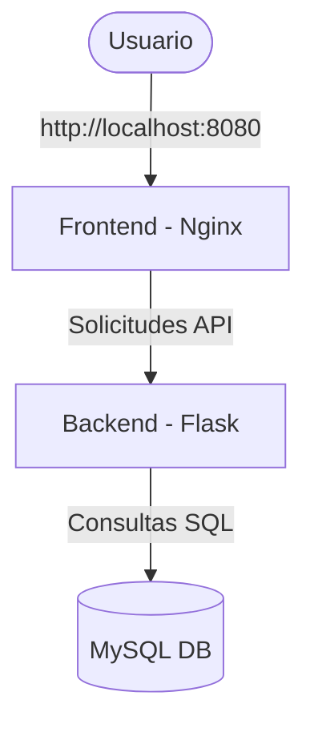

<<<<<<< HEAD
# CLOUD_LAB
Laboratorios del curso de Cloud
=======
# 🚀 Proyecto Cloud Lab1 - Aplicación con Frontend, Backend y Base de Datos

Este proyecto es un **laboratorio práctico de Cloud Computing** que muestra cómo desplegar una aplicación simple utilizando **contenedores Docker**.  

La aplicación está dividida en **tres servicios independientes**:
- **Frontend**: interfaz visual (HTML servido con Nginx).
- **Backend**: API sencilla en Python con Flask.
- **Base de datos**: MySQL con datos iniciales.

El objetivo es **aprender a usar Dockerfiles, Docker Compose y redes entre contenedores**.

---

## ⚙️ Configuración de los contenedores

Cada contenedor fue configurado mediante un **Dockerfile** para personalizar su entorno:

1. **Frontend**  
   - Basado en la imagen ligera `nginx:alpine`.  
   - Copia el archivo `index.html` para servirlo en el puerto `8080` de la máquina.  
   - Es el encargado de mostrar la capa visual al usuario.

2. **Backend**  
   - Basado en `python:3.9-slim`.  
   - Instala las dependencias (`flask` y `mysql-connector-python`).  
   - Expone el puerto `5000`.  
   - Se conecta a la base de datos usando variables de entorno (`DB_HOST`, `DB_USER`, `DB_PASSWORD`, `DB_NAME`).  
   - Provee una API que el frontend puede consumir.

3. **Base de datos (DB)**  
   - Basada en `mysql:8.0`.  
   - Configurada con usuario root (`root/root`) y base de datos inicial (`labdb`).  
   - Ejecuta el script `init.sql` para crear una tabla `usuarios` e insertar algunos registros de prueba.  
   - Mapea el puerto interno `3306` al **3307** de la máquina para evitar conflictos con instalaciones locales de MySQL.

---

## 🔗 Cómo interactúan los contenedores

- Los tres servicios están definidos en el archivo `docker-compose.yml`.  
- Docker Compose crea una **red interna** donde cada servicio puede ser alcanzado usando su **nombre de contenedor como host**.  
  - Ejemplo: el backend accede a la base de datos usando `db:3306` en lugar de `localhost`.  
- El flujo es el siguiente:
  1. El **usuario** abre `http://localhost:8080` → accede al frontend.  
  2. El **frontend** puede comunicarse con el **backend** en `http://backend:5000`.  
  3. El **backend** consulta a la **base de datos** en el host `db`.  

Este diseño simula una arquitectura de microservicios básica.  

### 🖼️ Diagrama del flujo de interacción



---

## 📌 Aspectos importantes

- Se utilizó `docker compose` para **levantar todos los servicios con un solo comando**.  
- Se evitó el conflicto de puertos usando el **3307** para MySQL.  
- Los contenedores se comunican gracias a la **red interna de Docker Compose** (no es necesario exponer puertos para la comunicación interna, solo para acceso externo).  
- Cada servicio tiene su propio **Dockerfile**, lo que garantiza portabilidad y reproducibilidad.  
- El sistema puede ejecutarse en cualquier máquina con Docker, sin necesidad de instalar manualmente Python, Nginx o MySQL.  

---

## ▶️ Cómo ejecutar el proyecto

1. Clonar el repositorio:
   ```bash
   git clone https://github.com/kemely2021/CLOUD_LAB.git
   cd Cloud/Lab1
   ```

2. Construir y levantar los contenedores:
   ```bash
   docker compose up -d --build
   ```

3. Verificar que los contenedores estén corriendo:
   ```bash
   docker ps
   ```

---

## 🌐 Acceso a la aplicación

- **Frontend:** [http://localhost:8080](http://localhost:8080)  
- **Backend:** [http://localhost:5000](http://localhost:5000)  
- **Base de datos MySQL:** disponible en el puerto `3307` con usuario `root` y contraseña `root`.  

---
>>>>>>> 5e0dc6d (Primer commit)
